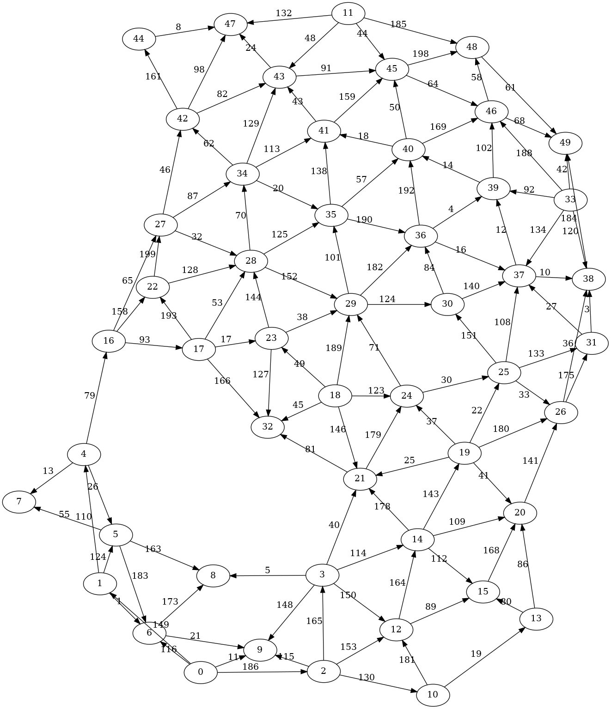

Program 7
---------
In this assignment, you will continue implementing various directed graph algorithms. You will also
begin working with some string processing algorithms.

Minimum Spanning Trees
----------------------
You work for a regional water utility company which has been selected to provide water from its
water treatment plants to various municipalities around the state. The locations and distances
between adjacent municipalities and the water treatment plants are shown in the figure below. The
edges show the costs to dig and build out pipeline between the vertices within the graph.

In order to save costs, your company wants to avoid building exclusive pipeline from water treatment
plants to each municipality individually. This means that some municipalities may be connected
directly to the water treatment plant and some municipalities may receive water through another
municipality.

Your company has tasked you to come up with the map of pipeline to build out. In order to minimize
the cost for the company, you decide to use a minimum spanning tree algorithm to connect every
municipality through the set of edges with minimum cost. Implement either Prim's or Kruskal's
algorithm for minimum spanning trees to determine the map of pipeline to build.

The file(s) you will need for this exercise are:

- `java/src/edu/berkeley/cs/graph/MinimumSpanningTree.java`

Shortest Paths
--------------
After completing your previous project determining the map of pipeline to build, management tasks
you with your next project. One of the design choices your company made in order to save costs was
to allow water to flow through a municipality on its way to its destination. This meant that the
company did not have to build dedicated pipelines from the water treatment plant to each
municipality that it served. However, it also means that from time to time, the water utility will
need to visit each municipality to inspect this infrastructure and ensure that it continues to work.
In the event that this infrastructure is vandalized, tampered with, or is otherwise broken,
downstream municipalities may not receive the water that they need for their citizens. The water
treatment plants are located at vertices 2, 7, 13, 23, and 29. The remaining vertices show the
locations of the various municipalities that are planned to be serviced.

The company has tasked you to come up with a plan that identifies which municipalities should be
served from each of its water treatment plants and the routes and distances that technicians must
use. In order to minimize cost, you decide to use a shortest path algorithm to determine the
shortest paths from a water treatment plant to all other municipalities. As the first step,
implement Dijkstra's shortest path algorithm to determine the shortest path from a single water
treatment plant to all other municipalities. Then, use your implementation of Dijkstra's shortest
path algorithm to determine the shortest paths from multiple source water treatment plants to all
municipalities.

Note: it might be tempting to simply run Dijkstra's algorithm with each water treatment plant as the
source. However, this will require multiple runs of Dijkstra's algorithm and will be inefficient,
especially for large graphs. Instead, find a way to run a single pass of Dijkstra's algorithm.

The file(s) you will need for this exercise are:

- `java/src/edu/berkeley/cs/graph/ShortestPath.java`
- `java/src/edu/berkeley/cs/graph/MultipleSourceShortestPath.java`

Grading
-------
Tests have already been written to help you ensure that your code works. The following commands will
be used to test and grade your code:

    $ bazel test java:program7
